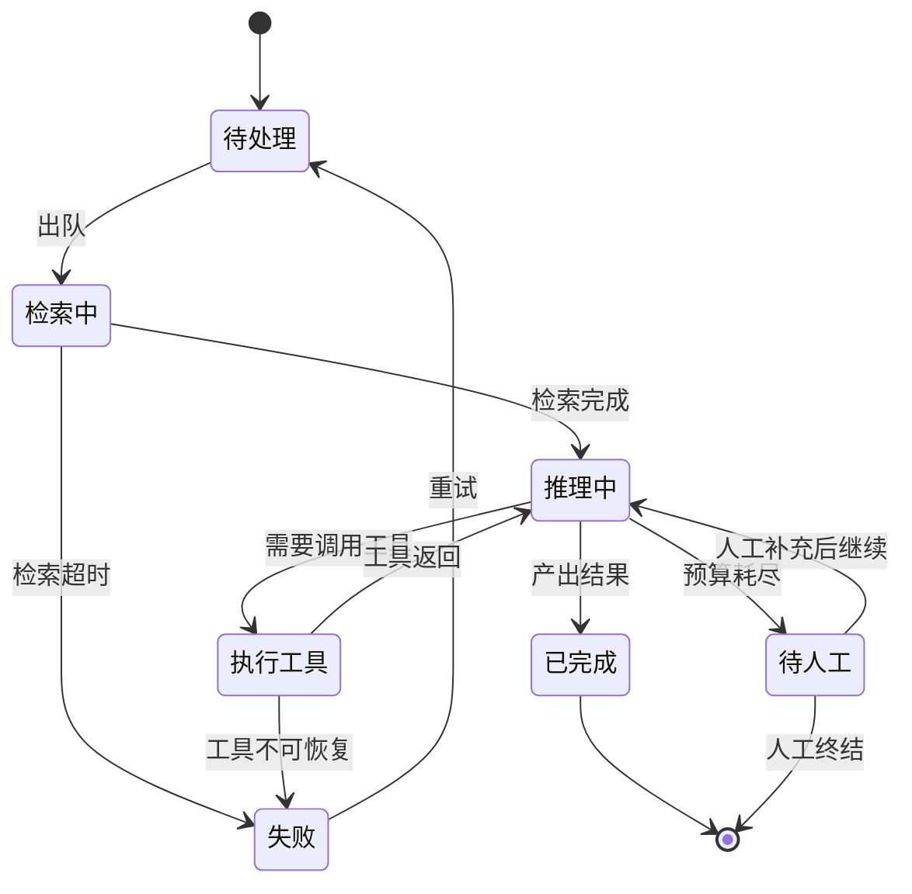

---
tags:
  - ai工程/工程基座
stage: 3
status: todo
aliases:
  - state machine
  - 状态机
---
「这个任务现在到底是什么状态？」——如果答案要靠翻日志拼出来，那就说明状态是隐式的，而隐式状态在长任务里必然出问题。

## 一句话

把长任务的状态**显式化并持久化**，每次转换都留痕、非法转换直接拒绝——这样「它卡在哪」永远是一次查询就能回答的问题。

## 原理

### 隐式状态的三个症状

状态散在代码的控制流里、只存在内存里、或者要从日志反推，就会出现：

- **说不清进度**——用户问「到哪了」，只能答「在处理中」
- **重启就丢**——进程一挂，跑了两分钟的任务从头再来
- **重复执行**——不知道某一步做没做过，重试时又做一遍

第三个最贵，因为它会产生真实的副作用（发两封邮件、扣两次款）。

### 显式状态长什么样

一个长任务的状态机，用 Mermaid 画：



有了这张图，几件事立刻变得可回答：现在在哪、下一步能去哪、哪些转换是非法的、卡住的任务卡在哪个状态。

### 三条硬要求

**一、状态要持久化。** 存数据库，不是存内存。进程重启后能从存储里读回来继续，见 [[05-断点续跑]]。

**二、每次转换都留痕。** 至少记：从哪到哪、什么时候、为什么、谁触发的。

```json
{"task": "t-8821", "from": "推理中", "to": "待人工",
 "at": "2026-07-31T10:22:03Z", "reason": "budget_exceeded",
 "detail": {"steps": 25, "cost": 0.84}}
```

**这份转换日志比应用日志有用得多**——它是结构化的、可聚合的，能直接回答「有多少任务卡在待人工、平均卡多久」。

**三、非法转换要拒绝。** 「已完成」不能回到「推理中」，「待处理」不能直接跳到「已完成」。把转换表写死在代码里，非法转换抛异常而不是默默执行。

这一条能挡住一整类并发 bug——两个 worker 同时拿到同一个任务时，第二个的转换会因为状态已变而失败，见 [[06-分布式锁]]。

### 和 agent 的关系

agent 的每一步本质上就是一次状态转换。所以：

- **步数上限**就是转换次数上限，见 [[01-五类硬预算]]
- **无进展检测**就是「状态没变但转换在发生」，见 [[02-终止条件]]
- **升级到人**就是转到「待人工」这个状态，而且**必须带上完整的中间状态**，人才接得住，见 [[03-升级到人与结构化中间状态]]

**很多 agent 失控问题的根源就是没有显式状态机**——它只是在一个 while 循环里反复调模型，没人知道它转了多少圈、在原地打转还是在推进。

### 状态设计的几条经验

**别太细。** 状态多到十几个就没人维护得动了。五到八个通常够。细节放进状态的附属数据里，而不是拆成更多状态。

**区分「终态」和「可恢复态」。** 已完成、人工终结是终态；失败、待人工是可恢复的。终态不能再转出去。

**给每个非终态定超时。** 一个任务卡在「执行工具」两小时，说明有东西挂了。定时扫描超时的状态并处理，见 [[03-超时与背压]]。

**状态本身要能被查询和聚合。** 「有多少任务在待人工」应该是一条 SQL，而不是要跑脚本分析日志。

## 动手做

- [ ] 给一个长任务画出状态机图，控制在八个状态以内
- [ ] 把状态持久化到数据库，验证进程重启后能读回来
- [ ] 实现转换表，故意做一次非法转换，确认被拒绝
- [ ] 记录转换日志，用一条 SQL 查出「卡在待人工的任务数和平均时长」
- [ ] 给每个非终态设超时，跑一个扫描器处理超时任务
- [ ] 模拟两个 worker 同时处理同一任务，确认第二个的转换失败

## 算学会了

- [ ] 「这个任务在哪个状态」是一次查询就能回答的
- [ ] 状态持久化，重启不丢
- [ ] 非法转换会被拒绝，而不是默默执行
- [ ] 转换日志是结构化的，能直接聚合
- [ ] 能把 agent 的步数、无进展、升级到人都映射到状态机上

## 坑

**状态只在内存里。** 重启就丢，长任务白跑。

**状态从日志反推。** 慢、不可靠、无法聚合。

**不校验转换合法性。** 并发场景下会出现「已完成的任务又开始执行」这种诡异情况。

**状态设计得太细。** 十几个状态没人维护得动，转换表变成一张迷宫。

**非终态没有超时。** 卡住的任务会永远卡着，占着资源还不报警。

## 关联
- [[01-异步任务队列]]
- [[05-断点续跑]]
- [[06-分布式锁]]
- [[02-终止条件]]
- [[03-升级到人与结构化中间状态]]

## 参考
- [Durable Execution Patterns for AI Agents](https://zylos.ai/research/2026-02-17-durable-execution-ai-agents/) — agent 状态与持久化执行的对应关系
- [Designing Data-Intensive Applications](https://dataintensive.net/) — 状态、事务与并发控制
